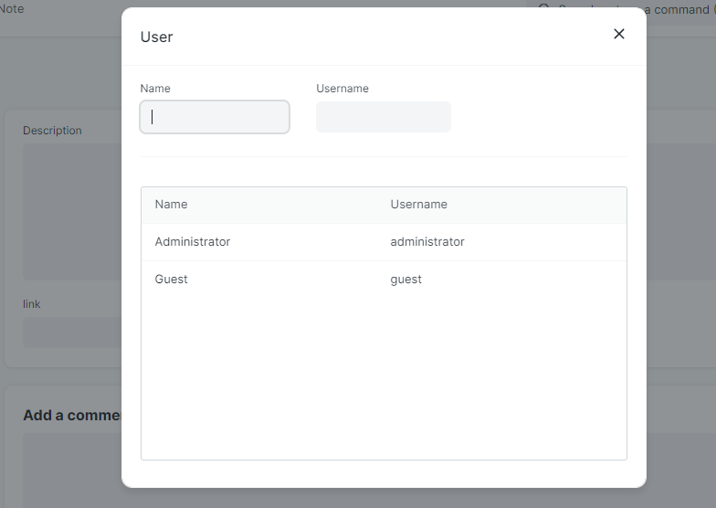
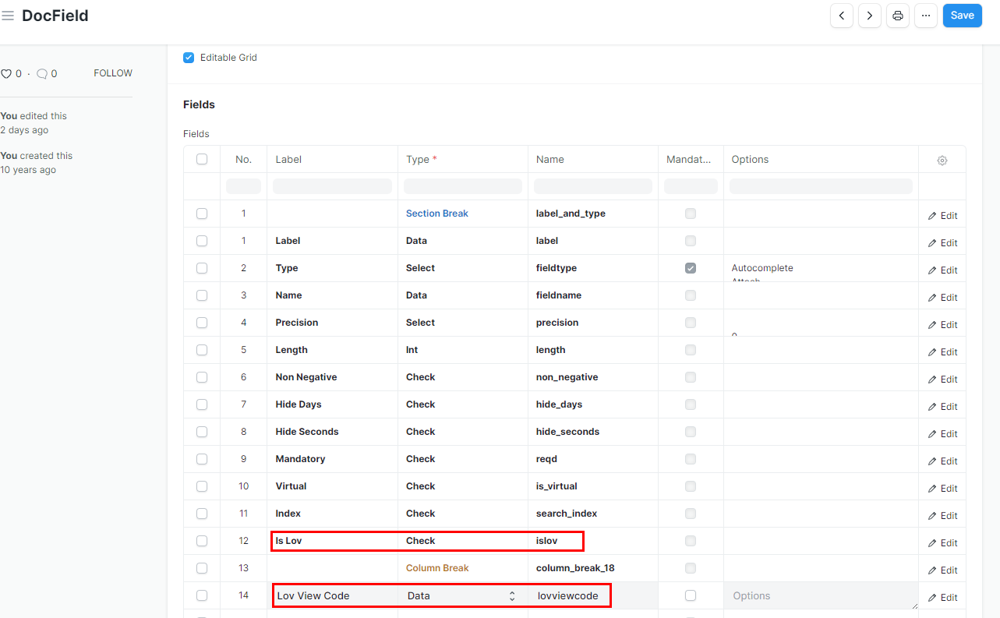
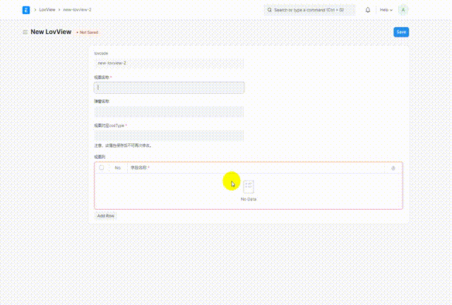
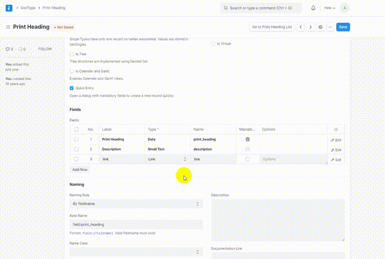
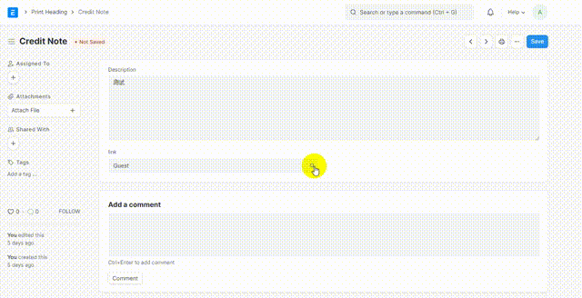

## Lov

LOV is an extension of the link component, which can display link selectable data in the form of a pop-up list. The view is generated by configuring the display column of the pop-up list and the associated docType. The link component will no longer bundle the docType, but will connect the UI and data by bundling the view.

lov 为 link 组件的一种扩充，可以以弹窗列表形式展示 link 可选择数据，通过配置弹窗列表的展示列与关联docType 来生成视图，link 组件此后不在捆绑 docType，而是通过捆绑视图的方式实现UI与数据连接。



### 安装

获取 lov 组件 

```bash
bench get-app https://github.com/wuzhan9697/frappe-link-lov.git
```

安装 lov 组件

```bash
bench --site {sitename} install-app lov
```

然后执行 [migrate 指令](https://frappeframework.com/docs/v14/user/en/bench/reference/migrate)

```bash
bench --site [sitename] migrate
```

> 注意的是运行这一句指令时，需要系统处于运行态
>
> 这一步作用是修改 DocField 文档的 Show Title in Link Fields 属性，以及为 link 组件添加 Is Lov 和 Lov View Code 属性。
>
> 如果不想执行该指令，您还可以手动添加这两个属性，需要配置好这两个属性的 Label、Type、Name即可，配置方式如下图所示。
> 

### 使用

安装成功后，您会发现在 doctype 列表中有 LovView 文档，选择这个文档进入其列表，添加一条数据，如下图。

添加的数据为一个视图，它可以绑定到多个 link 上。




安装成功后，你会发现在编辑 link 组件时会有 Is Lov 属性，选择它，然后输入刚刚配置好的 lov view code ，如下图。至此，即可配置好一个 link 组件 lov 样式了。



这时点击 link 组件输入框的放大镜图标，效果如下。



#### License

MIT